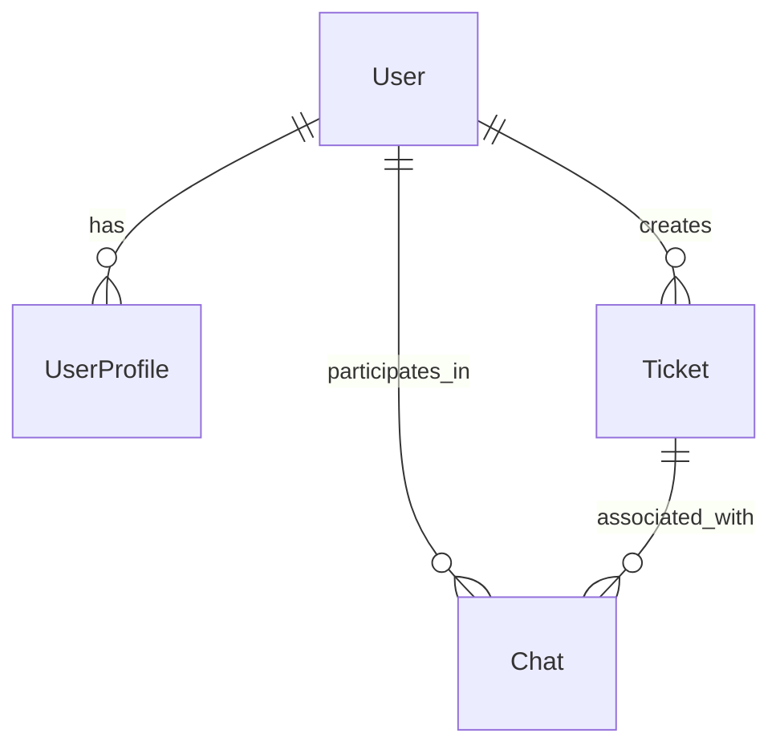
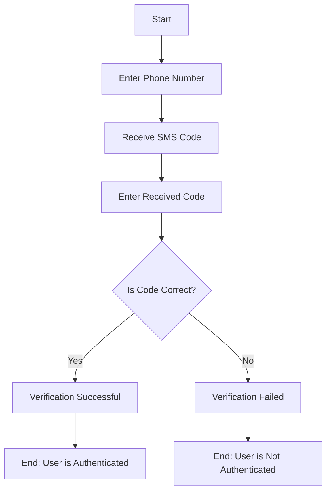
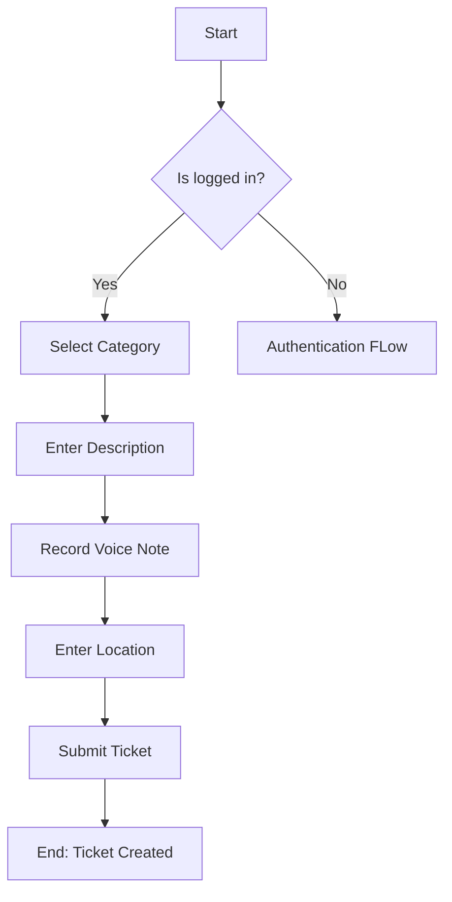
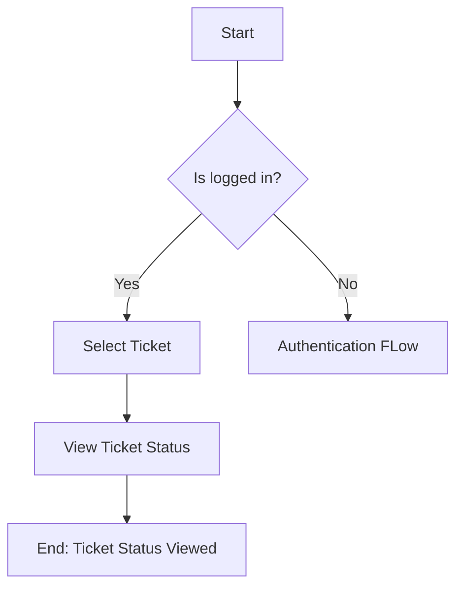
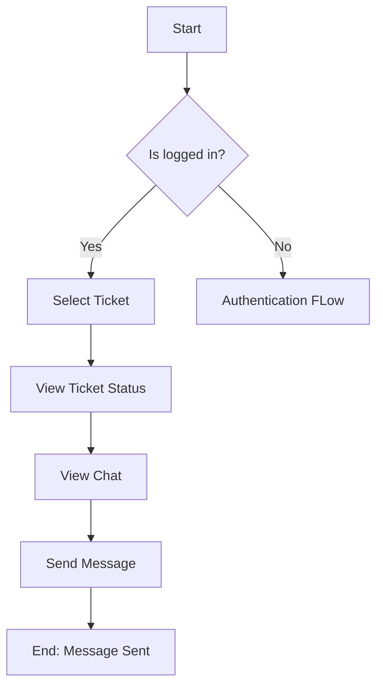
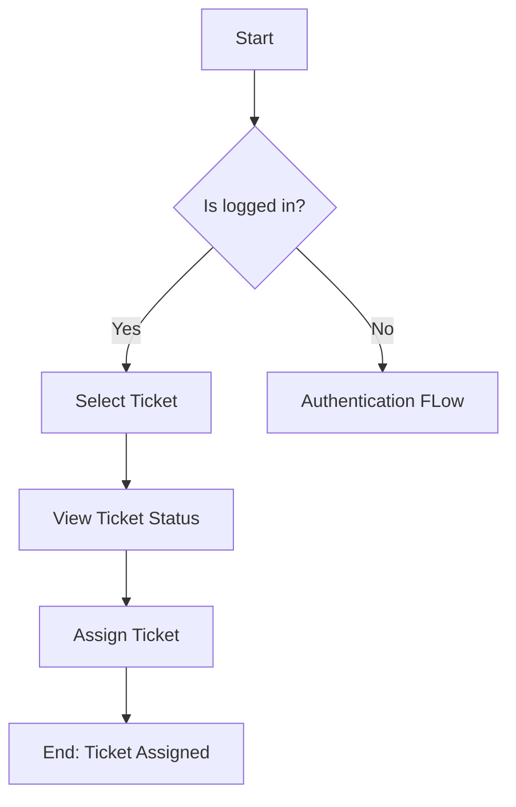
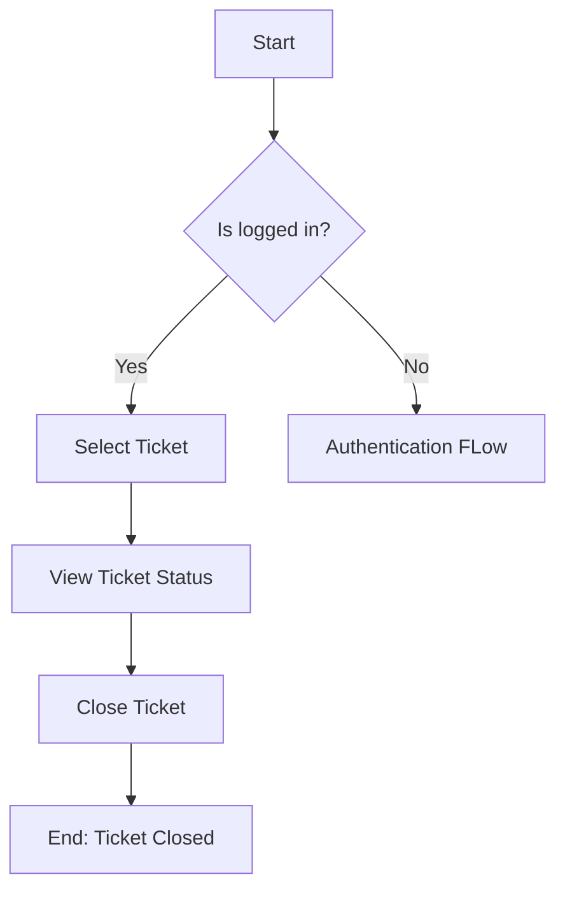
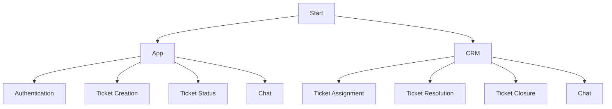

# St.Brosephs's App

# Motivations

##  The Website: 

This needs to be a place that informs people who are 100% unaware of us about what we do, what we have already done, how we can help/support/empower them with the resources we have etc. 

It will basically be a front to get people to understand what we do so that they feel convinced to come to us with their issues instead of just suffering in silence from whatever it is that they're going through.

As far as the tech functionality of the website goes, we basically just want to make a comforting website that profiles our work and activities, and for greater access to information, resources, and to actually reach out, we will be redirecting everyone to download the app.


## The App:

This will be on Android for the first version, and once we have a solid release with all the features we want, we can then port it to iOS as well. Currently my thought is that we need to:

- Give people a way to contact us directly with their specific issue and all the details. Basically they'll select an issue category, which will expand into subcategories, and every branch of the tree in this flowchart will have its own unique questions (same questions that I would normally ask the person in such a scenario) so that we have all this information at hand without having to waste any more time getting important details.

- The above will work on a ticket system where requesters can get updates on their ticket, and will be able to chat with us from the app itself to resolve their issue and/or add more details.

- People should have an emergency option to get our attention immediately if needed. This, of course will come with a notice that people should be contacting 112 if they really need emergency help and to only use this option if otherwise really required.

- We'll also need to have a separate path in the flow where instead of submitting a complaint, people can just ask a question and get an answer for something they're curious about. Eventually we can train a GPT (once the API becomes affordable) to answer such questions from our knowledgebase.

- Give people ways to volunteer / contribute. We can have forms for coordinators, tech team volunteers, Mental Health professionals etc. integrated on the app itself so that people don't have to go through a bunch of form links. Also in case someone wishes to make a financial contribution, they should be able to do it on the app itself.

- We'll need a backend interface integrated with some CRM system (either our own or another) where we can classify the tickets into various categories based on urgency, assign coordinators to work on them, assign deadlines/timelines for resolution, assign/schedule things like complaint writing meeting, police station visit, higher official visit, civic official visit, lawyer visit etc. 

This can be on the web for now and eventually we can make an app for this to be used only by coordinators / core team people with assigned levels of access/privileges depending on their role.

- We'll also have a resources / FAQ section which will be a knowledgebase for people to get answers to basic questions that they might have. The QnA flow should be able to take from this as well, over there it'll just be keywords based so can't be too complicated for now. 

So those are the app features/requirements that I'm thinking of right now for the app which we'll currently be working on.

---

In the future, eventually, I want to integrate the feature that I have discussed with some of you, where you can select your location and the app will tell you exactly which MP, MLA and Corporator constituencies you're in right now (alongwith names of those people), police station jurisdiction, traffic police station jurisdiction, BBMP ward name/number/office, closest emergency hospital, fire station that covers that specific area, and nearest veterinary hospital/facility. 

Eventually we'll give even more details besides this, like specific ward officers on duty, doctors on duty etc with their contact details. There will be a flow here as well, people can either ask for the information or they can start a complaint tree with the location triangulated (mostly for civic issues). After getting all the details of their issue, the app will forward it to the concerned authority and provide people with the contact details of the specific person they need to contact to follow-up.

We'll also add an option to `Escalate to Broseph` in case the officer is not resolving their issue.

# Architecture

## Backend/APIs

There is no dedicated backend/service/server for the v1 version of this App. The app will be using Firebase for authentication and storage. The app will continue to rely on Firestore SDK for data storage and retrieval. 

The schema proposed for the data is as follows:

```ts
// Self-explanatory
export enum TicketStatus {
  Pending = "Pending",
  Ongoing = "Ongoing",
  Resolved = "Resolved",
  Closed = "Closed",
  Invalid = "Invalid"
}

// Audio clip recorded by the user
export interface AudioRecord {
  id: string;
  source: string;
  duration: number;
}

// Location metadata for the ticket
export interface Location {
  id: string;
  displayName: string;
  address: string;
}

// Base ticket interface -- can be extended to create categories
export interface Ticket {
  id: string;
  userId: string;
  status: TicketStatus;
  description: string;
  category: string;
  urgent: boolean;
  location?: Location;
  voiceNote?: AudioRecord;
  createdDate: Date;
  lastModified: Date;
}

export interface User {
    id: string;
    phoneNumber: string;
    displayName: string;
    photoUri: string;
    email: string;
}

export interface UserProfile extends User {
    language: string;
    notificationToken: string;
    creationTime: Date;
    lastModifiedTime: Date;
    administrator: boolean;
}
```

## Website

The website will be a static website. The v1 version will be made using Framer and hosted using custom domains. In the v2 version, we shall introduce a CMS that allows to add new content to the website. The proposed stack for the website is as follows:
- React (Frontend)
- Firebase (Hosting)
- Sanity/Ghost/Strapi/Markdown in GitHub (CMS) -- open to suggestions

## App

Apps will be built using native Android and iOS SDKs. Worst case scenario, we will use React with PWA support for the site. The proposed stack for the app is as follows:
- Android SDK (Java/Kotlin)
- iOS SDK (Swift)
- React (Worst case scenario)
- Firebase (Authentication, Storage, Analytics, Crashlytics, Remote Config, Cloud Messaging, Performance Monitoring)

## CRM

The CRM will be a web app. The proposed stack for the CRM is as follows:
- React (Frontend)
- Firebase (Authentication, Storage, Analytics, Cloud Messaging, Performance Monitoring)

# Diagrams and Stuff

## Entity Relationship Diagram:

- A `User` has one `UserProfile`.
- A `User` creates one or many `Tickets`.
- A `User` participates in one or many `Chats`.
- A `Ticket` is associated with one or many `Chats`.



## User Flow -- Authentication

NOTE: Authentication is mandatory for users to create tickets. This is non-negotiable. We will not be accepting anonymous tickets.



## User Flow -- Ticket Creation

NOTE: Refer to Figma for the UI/UX flow.



## User Flow -- Ticket Status

NOTE: Refer to Figma for the UI/UX flow.



## User Flow -- Chat

NOTE: Refer to Figma for the UI/UX flow.



## CRM Flow -- Ticket Assignment

NOTE: Refer to Figma for the UI/UX flow.



## CRM Flow -- Ticket Resolution

NOTE: Refer to Figma for the UI/UX flow.


## CRM Flow -- Ticket Closure

NOTE: Refer to Figma for the UI/UX flow.



## CRM Flow -- Chat

NOTE: Refer to Figma for the UI/UX flow.


## Birds Eye View



# FAQs

Is this going to be open source?

- Yes and no. For the v1 and possibly v2 version of the app, we will not be open sourcing the code. We want to build a solid foundation for the app both in terms of code quality and contribution guidelines. Once we have a set process in place, which can be automated for things like code-quality, test coverage, documentation etc, we will open-source the code in a gradual manner.

Why not use an existing open source project?

- The requirements for building the v1 version of the CRM and the Website are very basic. We do not need a full-fledged CRM or a CMS yet. Once we start scaling and have a well-defined workflow, we can look at existing open source projects and see if we can use them. If not, we can also look at commercial solutions -- preferably that gives some sort of discount for non-profits.

Why not use a no-code solution?

- No-code solution is great for getting started, but as the requirements become more well-defined and specific, we might have to monkey-patch the no-code implementation to make it work. This will lead to a lot of technical debt and will make it difficult to scale.

Why not use React Native/Flutter/Other Cross-Platform Framework?

- We want everyone to be able to get up and running with the codebase as soon as possible. Introducing a new framework will increase the learning curve and will make it difficult for people to contribute. We want to keep the codebase as simple as possible so that it is easy to understand and contribute. The consensus is that React with basic HTML/CSS/JS is the easiest to understand and contribute to.

How can I start contributing?

- First, join the Discord channel: https://discord.gg/VagaDJKb
- Speak to any of the admins/tech leads, and they will help you get started.
